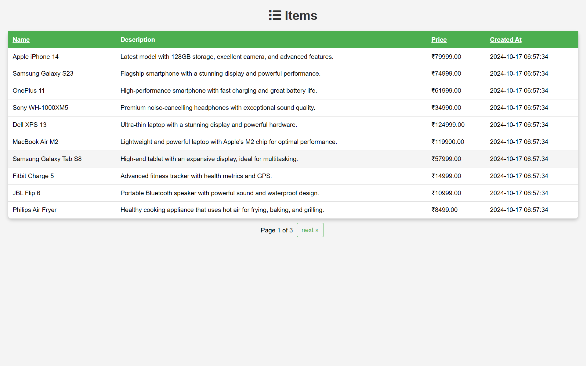
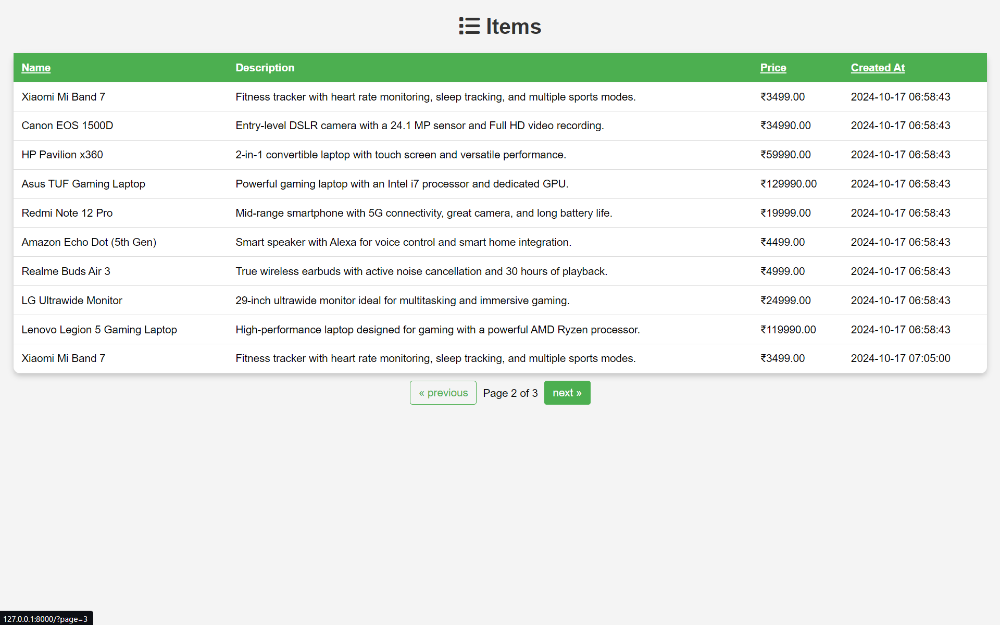
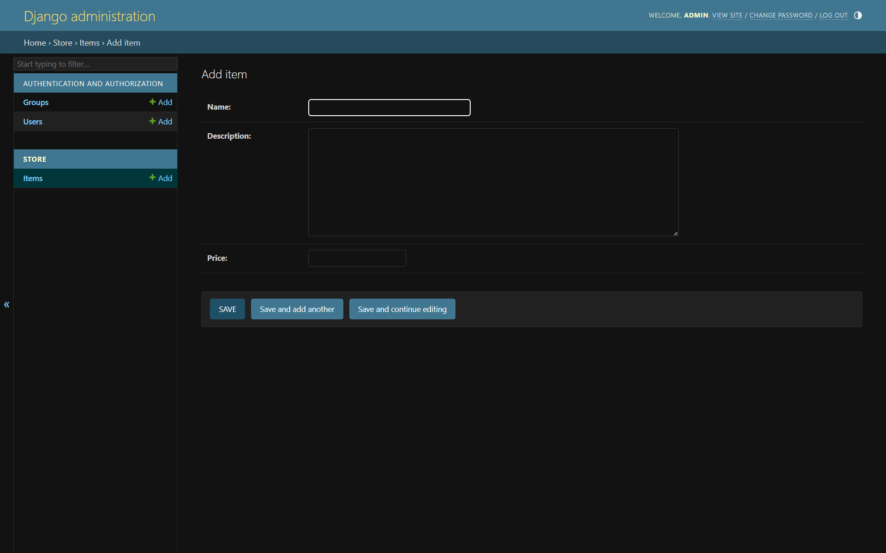

# ItemVault
Create a basic application using Django which can save items and display them
## Installation:
### Method - 1
Python and Django need to be installed
```Python
pip install django
```
### Method -2
We can do it in virtual environment also(optional)
- First create
```Python
python -m venv virtual_enviorment_name # Name it whatever you wish
```
Activate venv
```Python
.\venv\Scripts\activate
```
then install Django
```Python
pip install django
```

## Usage
Navigate to ItemVault folder
```Python
cd ItemVault
```
Then,
```Python
python manage.py runserver
```
Then go to the browser and enter the url http://127.0.0.1:8000/
## Admin page
You can access the django admin page at http://127.0.0.1:8000/admin and login with username 'admin' and the password 'admin'.

## Screenshots
### List1

### List2

### Admin Page



For 
